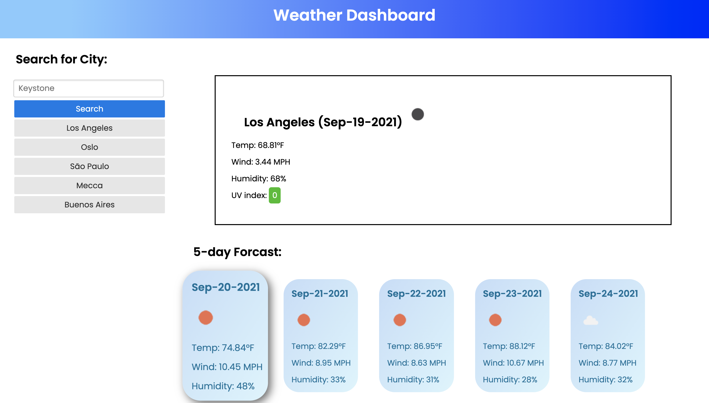

# Weather Dashboard

## Description
Get current weather info for cities around the globe aswell as the next 5 days.

### Features

- Enter a city, get weather info
- creates buttons for past succesful searches even after refreshing the screen.
- uv index value is colored according to official colors
- cards are transparent and float when cursor is over them

## Technologies Used

1. HTML
1. CSS
1. Javascript
1. APIs and Libraries
    - googleFonts
    - DOM API
    - Day.js
    - Pure.css
    - open weather map API

## Link

[Live Website](https://nicwille.github.io/work-day-calendar/)
- Made possible by Github Pages.